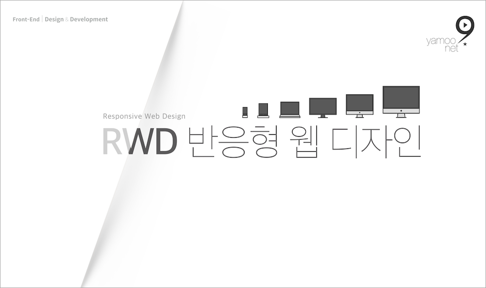

###### DAY 01 +

## 개념 정리

키노트를 통해 반응형 웹 디자인 개념과 핵심 원리를 정리한 후, 실습을 통해 체득하는 시간을 가져보겠습니다.

 

## 실습 진행

라이브 강의(또는 [영상 강의](https://fastcampus.teachable.com/p/d76599))를 참고하여 실습을 진행합니다.

### 1. RWD 핵심 원리
- [유연한 그리드](https://codepen.io/yamoo9/pen/bvXVmz/)
- [유연한 콘텐츠 이미지](https://codepen.io/yamoo9/pen/geVPNb)
- [유연한 배경 이미지](https://codepen.io/yamoo9/pen/GxVjWz)
- [크롭 배경 이미지](https://codepen.io/yamoo9/pen/oqKJaP)
- [크롭 콘텐츠 이미지](https://codepen.io/yamoo9/pen/PRMVpZ)
- [유연한 미디어](https://codepen.io/yamoo9/pen/pLMXQm)
- [중단점과 미디어 쿼리](https://codepen.io/yamoo9/pen/PeoYKw)

### 2. CSS 멀티 컬럼 디자인
- [CSS 멀티 컬럼](https://codepen.io/yamoo9/pen/aYgJEK/)

### 3. CSS Flexbox 레이아웃 모듈
- [CSS 모던 레이아웃 - Flexbox 인터랙티브 플레이그라운드](https://codepen.io/yamoo9/pen/qoGqaE/)
- [CSS 모던 레이아웃 with Flexbox ⇒ 01. Split Screen](https://codepen.io/yamoo9/pen/bvPxQe)
- [CSS 모던 레이아웃 with Flexbox ⇒ 02. Sidebar Layout](https://codepen.io/yamoo9/pen/VXJRjp)
- [CSS 모던 레이아웃 with Flexbox ⇒ 03. Sticky footer](https://codepen.io/yamoo9/pen/PRMoqO)
- [CSS 모던 레이아웃 with Flexbox ⇒ 04. Hero Cover](https://codepen.io/yamoo9/pen/RMXwJQ)
- [CSS 모던 레이아웃 with Flexbox ⇒ 05. Holy Grail](https://codepen.io/yamoo9/pen/GxVRzB)
- [CSS 모던 레이아웃 with Flexbox ⇒ 06. Equal Heihgt Elements](https://codepen.io/yamoo9/pen/zWgxYZ)

### 4. CSS Grid 레이아웃 모듈

- [CSS Grid 용어(Terminology)](https://codepen.io/yamoo9/pen/odgNQj)
- [간단한 그리드 레이아웃](https://codepen.io/yamoo9/pen/vjEEwj)
- [그리드 라인 넘버를 사용한 아이템 위치 설정](https://codepen.io/yamoo9/pen/odgLWK)
- [웹사이트 기본 레이아웃 ⇒ grid-area](https://codepen.io/yamoo9/pen/GdgVEv)
- [웹사이트 기본 레이아웃 ⇒ grid-template-areas](https://codepen.io/yamoo9/pen/LmEweR)
- [웹사이트 기본 레이아웃 ⇒ grid-area](https://codepen.io/yamoo9/pen/GdgVEv)
- [오더(order) 속성을 사용한 아이템 위치 설정](https://codepen.io/yamoo9/pen/vjOGEd)
- [자동 배치 흐름(grid-auto-flow) 제어](https://codepen.io/yamoo9/pen/MGwjPM)
- [자동 배치 패킹(Packing) 모드](https://codepen.io/yamoo9/pen/LmVbBd)
- [행/열 기준 내부 아이템 정렬](https://codepen.io/yamoo9/pen/RyPpGo)

 

## 레이아웃 유형

<h3>유형 1. 화면 분할(Split Screen)
</h3>

화면을 가로 방향으로 1:1로 분할한 후, 왼쪽에는 사진을 오른쪽에는 문구를 중앙 배치해봅니다. &gt; 참고: <a href="https://codepen.io/yamoo9/full/bvPxQe" target="_blank">완성 화면</a> 

 

<h3>유형 2. 사이드바 레이아웃(Sidebar Layout)
</h3>

왼쪽에 사이드바를 위치하고, 오른쪽에 메인 콘텐츠를 위치 시킵니다. 사이드바는 고정 포지션을  사용하지 않고도 화면에 고정된 듯 보이고, 메인 콘텐츠 영역은 스크롤이 가능해야 합니다. &gt; 참고: <a href="https://codepen.io/yamoo9/full/VXJRjp" target="_blank">완성 화면</a> 

 

<h3>유형 3. 스티키 푸터(Sticky Footer)
</h3>

메인 콘텐츠의 높이와 상관없이 항상 푸터는 하단에 붙어 있어야 합니다. 메인 콘텐츠 높이가 길어지면 스크롤바가 자동으로 생겨 메인 영역을 스크롤 할 수 있습니다. &gt; 참고: <a href="https://codepen.io/yamoo9/full/PRMoqO" target="_blank">완성 화면</a> 

 

<h3>유형 4. 히어로 커버(Hero Cover)
</h3>

사용자에게 우선 보여주고 싶은 콘텐츠 영역을 화면 상단에 배치하고, 가운데 콘텐츠를 보여줍니다. 마크업 순서는 사이트 로고와 내비게이션이 먼저 작성 되야 하지만, 화면 상 배치는 하단으로 이동해야 합니다. &gt; 참고: <a href="https://codepen.io/yamoo9/full/RMXwJQ" target="_blank">완성 화면</a> 

 

<h3>유형 5. 홀리 그레일(Holy Grail)
</h3>

홀리 그레일 레이아웃은 아래 그림과 같이 메인, 사이드바 영역을 3분할 하여 배치하는 것을 말합니다. 마크업 순서는 메인 &gt; 광고 &gt; 관련 링크 모음 순 이어야 합니다. 하지만 화면 상 배치는 메인이 가운데 위치해야 합니다. &gt; 참고: <a href="https://codepen.io/yamoo9/full/GxVRzB" target="_blank">완성 화면</a> 

 

<h3>유형 6. 이퀄 하이트(Equal Height)
</h3>

나열된 아이템이 포함한 콘텐츠의 높이에 상관 없이 모두 동일한 높이를 가져야 합니다. &gt; 참고: <a href="https://codepen.io/yamoo9/full/zWgxYZ/" target="_blank">완성 화면</a>

 

## 참고자료

### CSS Flexbox Modules

<ul>
	<li><a href="https://codepen.io/yamoo9/pen/LdoxoB" target="_blank">CSS 모던 레이아웃 - Flexbox 시작하기! (실습 용도)</a></li>
	<li><a href="https://codepen.io/yamoo9/full/qoGqaE" target="_blank">CSS 모던 레이아웃 - Flexbox 인터랙티브 (실습)</a></li>
	<li><a href="https://www.w3.org/TR/css-flexbox-1/" target="_blank">CSS Flexible Box Layout Module Level 1</a></li>
	<li><a href="https://developer.mozilla.org/ko/docs/Web/CSS/CSS_Flexible_Box_Layout/Flexbox%EC%9D%98_%EA%B8%B0%EB%B3%B8_%EA%B0%9C%EB%85%90" target="_blank">Flexbox의 기본 개념</a></li>
	<li><a href="https://www.vobour.com/1-flexbox-%EC%9D%B4%ED%95%B4-%EB%8B%B9%EC%8B%A0%EC%9D%B4-%EC%95%8C%EC%95%84%EC%95%BC-%ED%95%A0-%EB%AA%A8%EB%93%A0-%EA%B2%83-understa" target="_blank">Flexbox 이해: 당신이 알아야 할 모든 것</a></li>
	<li><a href="http://ko.learnlayout.com/flexbox.html" target="_blank">CSS 레이아웃을 배웁시다. - Flexbox</a></li>
	<li><a href="https://hyunseob.github.io/solved-by-flexbox-kr/" target="_blank">Solved by Flexbox (한국어 번역)</a></li>
	<li><a href="https://css-tricks.com/snippets/css/a-guide-to-flexbox/" target="_blank">A Complete Guide to Flexbox</a></li>
	<li><a href="https://yoksel.github.io/flex-cheatsheet/#order" target="_blank">Flexbox Cheatseet</a></li>
	<li><a href="https://www.w3schools.com/css/css3_flexbox.asp" target="_blank">CSS Flexbox</a></li>
  <li><a href="http://flexboxfroggy.com/#ko" target="_blank">Flexbox 개구리 게임</a></li>
</ul>

### Multi Columns

<ul>
	<li><a href="https://www.w3.org/TR/css-multicol-1/" target="_blank">CSS Multi-column Layout Module Level 1</a></li>
	<li><a href="https://developer.mozilla.org/ko/docs/CSS3_Columns" target="_blank">CSS 다단 레이아웃 사용</a></li>
</ul>

### CSS Grid Modules

<ul>
	<li><a href="https://www.w3.org/TR/css-grid-1/" target="_blank">CSS Grid Layout Module Level 1</a></li>
	<li><a href="https://www.w3.org/TR/css-grid-2/" target="_blank">CSS Grid Layout Module Level 2 (초안, 개발 중...)</a></li>
	<li><a href="https://developer.mozilla.org/ko/docs/Web/CSS/CSS_Grid_Layout" target="_blank">Introduction to CSS Grid Layout</a></li>
	<li><a href="https://github.com/yamoo9/CSS-Grid" target="_blank">CSS Grid 레이아웃 모듈 레벨 1(번역)</a></li>
	<li><a href="https://www.cssgridplayground.com/" target="_blank">cssgridplayground.com</a></li>
	<li><a href="https://gridbyexample.com/" target="_blank">gridbyexample.com</a></li>
	<li><a href="https://autoprefixer.github.io/" target="_blank">autoprefixer.github.io</a></li>
	<li><a href="https://cssgridgarden.com/#ko" target="_blank">Grid 정원 가꾸기 게임</a></li>
</ul>

### Responsive Web Design

<ul>
	<li><a href="http://www.alistapart.com/articles/responsive-web-design/" target="_blank">반응형 웹 디자인 (Responsive Web Design)</a></li>
	<li><a href="http://book.naver.com/bookdb/book_detail.nhn?bid=12712464" target="_blank">반응형 웹디자인 (도서)</a></li>
  <li><a href="http://trentwalton.com/2011/07/14/content-choreography/" target="_blank">콘텐츠 구성 (Content Choreography)</a></li>
	<li><a href="https://blog.kulturbanause.de/2013/12/content-choreography-fur-responsive-websites/" target="_blank">반응형 웹사이트를 위한 콘텐츠 구성 (Content Choreography for responsive Websites)</a></li>
	<li><a href="jordanm.co.uk/2012/04/26/building-with-content-choreography.html" target="_blank">콘텐츠 구성 빌딩 (Building with Content Choreography)</a></li>
	<li><a href="http://alistapart.com/article/fluidgrids" target="_blank">유연한 그리드 (Fluid Grids)</a></li>
	<li><a href="https://pineco.de/the-relative-units-of-css/" target="_blank">CSS 상대 단위</a></li>
	<li><a href="https://caniuse.com/#feat=rem" target="_blank">상대 단위 - rem</a></li>
	<li><a href="https://caniuse.com/#feat=viewport-units" target="_blank">상대 단위 - 뷰포트(Viewport) vw, vh, vmin, vmax</a></li>
	<li><a href="https://caniuse.com/#feat=calc" target="_blank">calc() 함수</a></li>
  <li><a href="https://alistapart.com/article/fluid-images" target="_blank">유연한 이미지 (Fluid Images)</a></li>
  <li><a href="https://stackoverflow.com/questions/18247356/how-to-center-crop-an-image-img-in-fluid-width-container?utm_medium=organic&utm_source=google_rich_qa&utm_campaign=google_rich_qa" target="_blank">다른 크롭 이미지 방법 (콘텐츠 이미지의 경우)</a></li>
  <li><a href="https://blog.theodo.fr/2018/01/responsive-iframes-css-trick/" target="_blank">Responsive Iframes with One Great CSS Trick</a></li>
	<li><a href="https://medium.com/specialist-channel-best-way-to-get-shopify-hel/how-to-make-youtube-video-responsive-in-shopify-a-shopify-small-tweak-3c70ddd1c253" target="_blank">How to make Youtube video responsive in Shopify – A Shopify Small Tweak</a></li>
  <li><a href="https://medium.com/@pnowelldesign/pixel-density-demystified-a4db63ba2922" target="_blank">Pixel Density, Demystified</a></li>
	<li><a href="https://brunch.co.kr/@blackindigo-red/18" target="_blank">Pixel Density, Demystified (번역 글)</a></li>
  <li><a href="https://developers.google.com/web/tools/chrome-devtools/device-mode/emulate-mobile-viewports?hl=ko" target="_blank">응답형 및 기기별 뷰포트 테스트</a></li>
	<li><a href="http://gs.statcounter.com" target="_blank">Stat Counter</a></li>
	<li><a href="https://www.w3counter.com/globalstats.php" target="_blank">W3 Counter</a></li>
	<li><a href="http://www.internettrend.co.kr/trendForward.tsp" target="_blank">internettrend.co.kr</a></li>
  <li><a href="http://vizdevices.yesviz.com/" target="_blank">디스플레이, 스크린 &amp; 운영체제 정보</a></li>
	<li><a href="http://viewportsizes.com" target="_blank">viewportsizes.com</a></li>
	<li><a href="http://troy.labs.daum.net" target="_blank">Troy 서비스</a></li>
	<li><a href="https://material.io/resizer" target="_blank">resizer</a></li>
	<li><a href="https://www.paintcodeapp.com/news/iphone-x-screen-demystified" target="_blank">iPhone X Screen Demystified</a></li>
	<li><a href="https://www.paintcodeapp.com/news/ultimate-guide-to-iphone-resolutions" target="_blank">The Ultimate Guide To iPhone Resolutions</a></li>
	<li><a href="https://51degrees.com/blog/samsung-galaxy-s9-and-s9-user-agents" target="_blank">Samsung Galaxy S9, S9+ User Agent String</a></li>
</ul>

### Responsive Web Design - Typography

- [Responsive Typography The Basics](https://ia.net/topics/responsive-typography-the-basics)
- [Responsive typography made easy](https://coderwall.com/p/d2mbca/responsive-typography-made-easy)
- [Design a responsive site with em-based sizing](https://www.creativebloq.com/how-to/design-a-responsive-site-with-em-based-sizing)
- [Best Practices for Responsive Typography](https://www.degordian.com/education/blog/best-practice-for-responsive-typography/)
- [Understanding and Using rem Units in CSS](https://www.sitepoint.com/understanding-and-using-rem-units-in-css/)
- [There’s more to the CSS rem unit than font sizing](https://css-tricks.com/theres-more-to-the-css-rem-unit-than-font-sizing/)
- [Building Resizeable Components with Relative CSS Units](https://css-tricks.com/building-resizeable-components-relative-css-units/)
- [Fluid Typography](https://css-tricks.com/snippets/css/fluid-typography/)