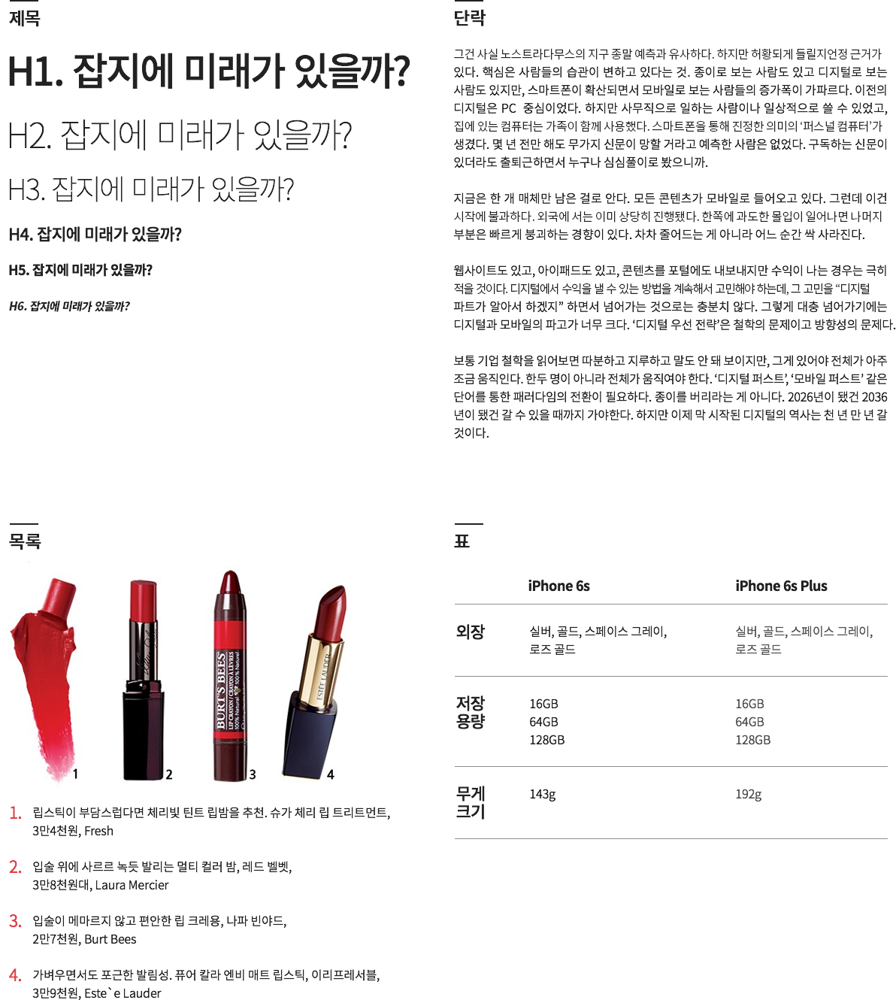
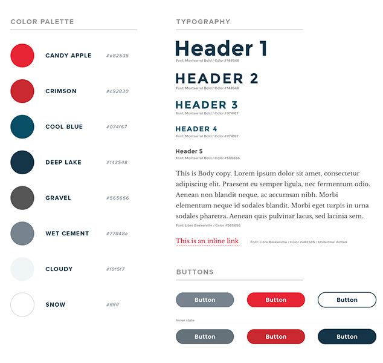

###### CJ Olive Networks

## Style Guide

스타일 가이드의 개념은 '패턴 라이브러리', 'UI 툴킷', 'UI 가이드라인' 등등 소통하는 방식은 각양각색. 어떤 단어로 소통하는 것은 중요하지 않지만 그 의미는 우리가 통일할 필요가 있다. **스타일 가이드는 웹 사이트를 만드는 이들을 위한 설명서와 재료**. 디자이너, 개발자, 콘텐츠 제작자 혹은 협력업체 사람간의 소통을 위한 도구.

-

#### 간단한 웹 디자인 스타일 가이드 예시 1

- 제목
- 단락
- 목록
- 표

-



-

#### 간단한 웹 디자인 스타일 가이드 예시 2

- 컬러 팔레트
- 타이포그래피(제목,단락,링크)
- 버튼

-



-

##### 국외 웹 스타일 가이드

- [Mozilla Sandstone](https://www.mozilla.org/en-US/styleguide/websites/sandstone/)
- [Disqus Brand & Style Guide](https://disqus.com/pages/style-guide/)
- [airbnb](https://dribbble.com/shots/1669299-Airbnb-UI-Toolkit-Web/attachments/263198)
- [Mailchimp Patterns](http://ux.mailchimp.com/patterns)
- [findguidelin.es](http://findguidelin.es/)
- [brand.uber](https://brand.uber.com/)
- [work.co](http://www.work.co/grid/)

-

##### 국내 웹 스타일 가이드

- [가비야(Gabia) 스타일 가이드](http://design.gabia.com/wordpress/?cat=12)
- [한국인터넷 진흥원 웹 스타일 가이드](http://www.kisa.or.kr/styleguide/styleguide.html)
- [인쿠프트 스타일 가이드](http://webguide.incruit.com/aboutstyleguide.asp)
- [한국 웹 스타일 가이드 모음](https://kr.pinterest.com/geunyoungkim77/%EC%9B%B9-%EC%8A%A4%ED%83%80%EC%9D%BC-%EA%B0%80%EC%9D%B4%EB%93%9C/)

-

##### 스타일 가이드 도구
- [stylifyme.com](http://stylifyme.com/)
- [patternlab.io](http://patternlab.io/)
- [fbrctr.github.io](http://fbrctr.github.io/)
- [frontify.com](https://frontify.com/styleguide)
- [Style-Guide-Boilerplate](http://bjankord.github.io/Style-Guide-Boilerplate/)
- [hugeinc.github.io/styleguide](http://hugeinc.github.io/styleguide)

---

### 타이포그래피 시스템 (Typography System)

디자인 원칙에 따른 타이포그래피를 설계(Design)함을 말한다.

#### 모듈러 스케일(Modular Scale)

모듈러 스케일이란? 관계된 객체 간에 개별적으로 일정한 배율(Ratio)이 반영된 수의 나열이다.


##### 타입 스케일 배율(Type Scale Ratio)

- `1.067` — Minor Second
- `1.125` — Major Second
- `1.200` — Minor Third
- `1.250` — Major Third
- `1.333` — Perfect Fourth
- `1.414` — Augmented Fourth
- `1.500` — Perfect Fifth
- `1.600` — Minor Sixth
- `1.618` — Golden Ratio (황금 비율)
- `1.667` — Major Sixth
- `1.778` — Minor Seventh
- `1.875` — Major Seventh
- `2.000` — Octave
- `2.500` — Major Tenth

-

#### 베이스라인(Baseline)

베이스라인이란? 행(Row) 사이 간격으로 글자 크기(Font Size)를 포함하는 높이를 말한다.


-

#### 버터컬 리듬(Vertical Rhythm)

버티컬 리듬이란? 각 요소(Elements) 간의 수직적인 공간 배열 관계를 말한다.


-

#### 타이포그래피 시스템이 반영된 디자인

왼쪽 vs 오른쪽 결과물 중, 디자인 관점에서 우수한 것은 무엇일까?


---

### CSS 타이포그래피 시스템 & 모듈러 스케일

**모듈러 스케일** & **베이스라인** & **버티컬 리듬**이 반영된 타이포그래피 시스템 아름답지 아니한가?


수업 과정에서 만들어 본 Typography System 결과물


-

##### 모듈러 스케일을 반영한 단락, 제목 글자 크기 설정

> 폰트크기(font-size): 이전 폰트크기(previous-font-size) × 타입배율(type-scale)

```css
h5 {
  font-size: 1.125rem; /* (1 × 1.125) */
}

h6 {
  font-size: 1rem; /* 1rem = 16px */
}
```

-

##### 재사용 가능한 클래스 속성 설정

```css
h1,
.exa {
  font-size: 1.8020rem;
}

⋮

h6,
.kilo {
  font-size: 1rem;
}
```

-

##### 크기 범주를 넓히는 클래스 속성 설정

[미터법 접두사(Metric Prefix)](https://en.wikipedia.org/wiki/Metric_prefix)

```css
.yotta {
  font-size: 2.2807rem;
}

.zetta {
  font-size: 2.0273rem;
}

⋮

small, .milli {
  font-size: 0.8889rem;
}

.micro {
  font-size: 0.7901rem;
}
```

---

### 버티컬 리듬

```css
h1, h2, h3, h4, h5, h6,
p, ul, ol, dl, dd, figure,
blockquote, details, hr,
fieldset, pre, table {
  margin: 0 0 1.5rem;
}
```

-

##### 행간 설정 공식

> 행간(line-height): ceil( 폰트크기(font-size) ÷ 기본행간(base-line-height) ) × ( 기본행간(base-line-height) ÷ 폰트크기(font-size) )

```css
h1, .exa {
  /* line-height: ceil(1.802 ÷ 1.5) × (1.5 ÷ 1.802) */
  font-size: 1.8020rem;
  line-height: 1.6648;
}
```

-

##### 재사용 가능한 행간 클래스 속성 설정

```css
/* 공간 x1 */
.push {
  margin-bottom: 1.5rem;
}

/* 공간 제거 */
.push-none {
  margin-bottom: 0;
}

/* 공간 x2 */
.push-double {
  margin-bottom: 3rem;
}

/* 공간 1/2x */
.push-half {
  margin-bottom: 0.75rem;
}
```

---

### 모듈러 타이포그래피 도구

- [Typografier](http://typografier.web-dev.tools/)
- [type-scale](http://type-scale.com/)
- [modularscale](http://www.modularscale.com/)
- [gridlover](http://www.gridlover.net/)
- [typography-grid-system-generator](http://www.sassmeister.com/gist/67672ba2a9caf1b947800d2be563c60c)

### 읽어볼 참고 자료

- [A More Modern Scale for Web Typography](http://typecast.com/blog/a-more-modern-scale-for-web-typography)
- [How To Use Size, Scale, And Proportion In Web Design](http://vanseodesign.com/web-design/size-scale-proportion/)

<!-- [Vertical Rhythm and Modular Scale: Typesettings](http://www.slideshare.net/iancrose/vertical-rhythm-and-modular-scale-typesettings) -->

-

#### EM vs REM

```css
/* EM vs REM */
/* Root Element = HTML 문서의 뿌리 요소 */
html {
	font-size: 16px;
}

body {
	font-size: 0.88em; /* 16 x 0.88 = 14 */
	font-size: 0.88rem; /* 16 x 0.88 = 14 */
}

div {
	font-size: 1.07em; /* 16 x 0.88 x 1.07 = 15 */
	font-size: 0.94rem; /* 16 x 0.94 = 15 */
}

div p {
	font-size: 0.87em; /* 16 x 0.88 x 1.07 = 13 */
	font-size: 0.81rem; /* 16 x 0.81 = 13 */
}
```

-

### Grid System

- [960.gs](http://960.gs/)
- [1200px.com](http://1200px.com/)
- [gridulator.com](http://gridulator.com/)

-

### 참고자료

- [entitycode.com](http://entitycode.com/)